

---

<h1 align="center">Hi 👋, I'm Your Name</h1>

<h3 align="center">A passionate Frontend / MERN Stack Developer from Bangladesh</h3>

I love building modern, responsive, and user-friendly web applications.  
Currently, I am learning advanced JavaScript, React, Node.js, and full-stack development.

---

## 👨‍💻 About Me

- 🔭 I’m currently working on **MERN Stack Projects**
- 🌱 I’m currently learning **Next.js, TypeScript, and MongoDB**
- 👯 I’m looking to collaborate on **open-source and frontend projects**
- 💬 Ask me about **HTML, CSS, JavaScript, React, Tailwind CSS**
- 📫 Reach me at **your-email@example.com**
- ⚡ Fun fact: **I enjoy turning ideas into real web applications**

---

## 🚀 Tech Stack

<table>
  <tr>
    <td align="center" width="120">
      
       <b>HTML5</b>
    </td>
    <td align="center" width="120">
      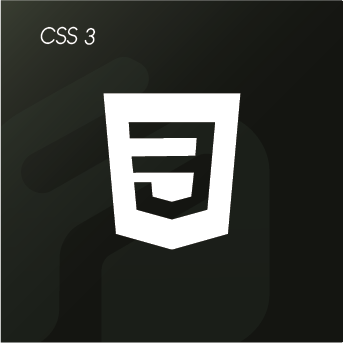
       <b>CSS3</b>
    </td>
    <td align="center" width="120">
      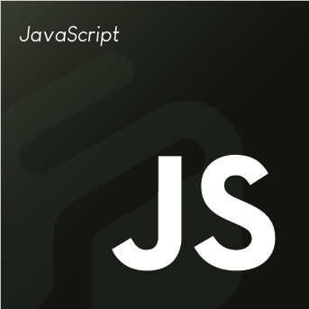
       <b>JavaScript</b>
    </td>
    <td align="center" width="120">
      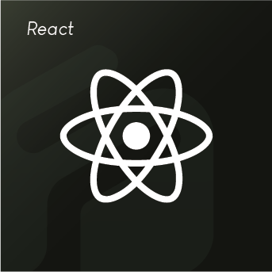
       <b>React</b>
    </td>
  </tr>

  <tr>
    <td align="center" width="120">
      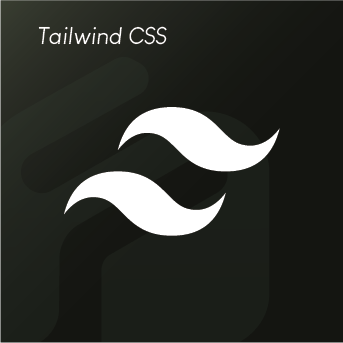
       <b>Tailwind</b>
    </td>
    <td align="center" width="120">
      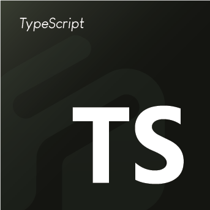
       <b>TypeScript</b>
    </td>
    <td align="center" width="120">
      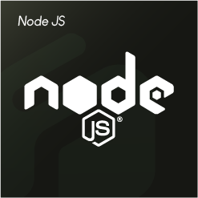
       <b>Node.js</b>
    </td>
    <td align="center" width="120">
      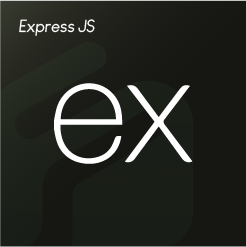
       <b>Express.js</b>
    </td>
  </tr>

  <tr>
    <td align="center" width="120">
      
       <b>MongoDB</b>
    </td>
    <td align="center" width="120">
      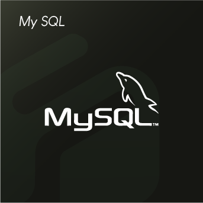
       <b>MySQL</b>
    </td>
    <td align="center" width="120">
      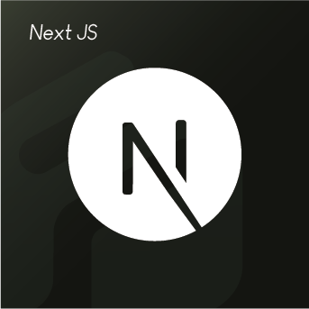
       <b>Next.js</b>
    </td>
    <td align="center" width="120">
      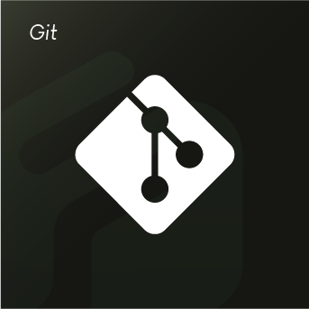
       <b>Git</b>
    </td>
  </tr>

  <tr>
    <td align="center" width="120">
      
       <b>GitHub</b>
    </td>
    <td align="center" width="120">
      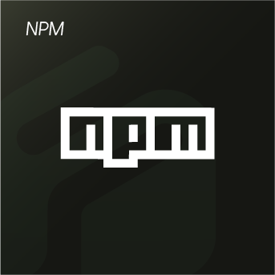
       <b>NPM</b>
    </td>
    <td align="center" width="120">
      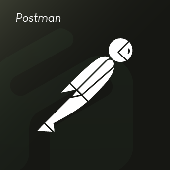
       <b>Postman</b>
    </td>
    <td align="center" width="120">
      
       <b>VS Code</b>
    </td>
  </tr>
</table>

---

## 📌 Featured Projects

### 🌐 Project One
A short description of your project.

- Live Site: `your-live-link`
- Repository: `your-repo-link`
- Technologies: React, Tailwind CSS, Firebase

### 🛒 Project Two
A short description of your project.

- Live Site: `your-live-link`
- Repository: `your-repo-link`
- Technologies: MERN Stack

### 📱 Project Three
A short description of your project.

- Live Site: `your-live-link`
- Repository: `your-repo-link`
- Technologies: Next.js, TypeScript

---

## 📊 GitHub Stats

  

  

---

## 🌐 Connect With Me

&nbsp;&nbsp;

<a href="https://www.linkedin.com/in/YOUR_LINKEDIN_USERNAME">
  LinkedIn
</a>

&nbsp;&nbsp;

<a href="mailto:your-email@example.com">
  Email
</a>

---

