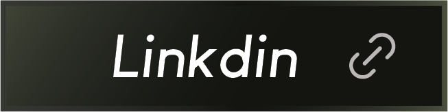

---

## 💪 Our Mission_

Our mission is to provide personalized learning, develop skills,  
and empower individuals to kick-start their careers.

---

## 📈 Our Impacts_

| 2600+ | 1200+ | 17+ |
|------:|------:|----:|
| successful job placements globally | partner companies for hiring needs | dedicated job placement executives |

---

## 📬 Contact with us

&nbsp;

&nbsp;

---

## ⚡ X-Factors Of Programming Hero_

<table>
  <tr>
    <td width="33%">
      <h3>Zero to Career</h3>
      
A complete journey from absolute beginner to job-ready developer.

    </td>
    <td width="33%">
      <h3>Support</h3>
      
One-to-one live support sessions, seven days a week.

    </td>
    <td width="33%">
      <h3>Job Placement</h3>
      
Job-focused guidance and placement support.

    </td>
  </tr>
  <tr>
    <td width="33%">
      <h3>Utilities</h3>
      
Offline module and desktop app support.

    </td>
    <td width="33%">
      <h3>Project Based</h3>
      
Learn by building real-world projects.

    </td>
    <td width="33%">
      <h3>Live Session</h3>
      
Live coding sessions for hands-on learning.

    </td>
  </tr>
</table>

---

## 💡 What You Will Learn_

<table>
  <tr>
    <td align="center" width="120">
      
       
      <b>HTML5</b>
    </td>
    <td align="center" width="120">
      
       
      <b>CSS3</b>
    </td>
    <td align="center" width="120">
      
       
      <b>JavaScript</b>
    </td>
    <td align="center" width="120">
      
       
      <b>React</b>
    </td>
  </tr>

  <tr>
    <td align="center" width="120">
      
       
      <b>Tailwind CSS</b>
    </td>
    <td align="center" width="120">
      
       
      <b>TypeScript</b>
    </td>
    <td align="center" width="120">
      
       
      <b>Node.js</b>
    </td>
    <td align="center" width="120">
      
       
      <b>Express.js</b>
    </td>
  </tr>

  <tr>
    <td align="center" width="120">
      
       
      <b>MongoDB</b>
    </td>
    <td align="center" width="120">
      
       
      <b>MySQL</b>
    </td>
    <td align="center" width="120">
      
       
      <b>Next.js</b>
    </td>
    <td align="center" width="120">
      
       
      <b>Git</b>
    </td>
  </tr>

  <tr>
    <td align="center" width="120">
      
       
      <b>GitHub</b>
    </td>
    <td align="center" width="120">
      
       
      <b>NPM</b>
    </td>
    <td align="center" width="120">
      
       
      <b>Postman</b>
    </td>
    <td align="center" width="120">
      
       
      <b>VS Code</b>
    </td>
  </tr>
</table>

---

## 🌐 Our Community_

&nbsp;&nbsp;

---

