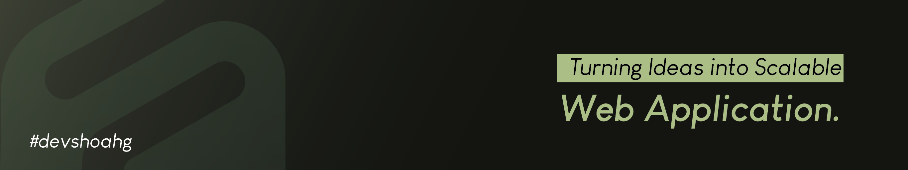

  

<h1 align="center">Hi there 👋, I'm Shohag</h1>

A MERN stack developer and CSE student with a strong interest in building applications using JavaScript and Python.

## 🛠️ Tech Stack

### 🎨 Frontend

  
  
  
  
  
  
  

### ⚙️ Backend

  
  

### 🗄️ Database

  
  

### 🧰 Tools

  
  
  
  
  

## 🌐 Connect with Me

  
  
  

  

